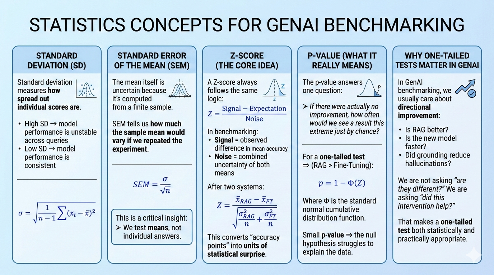

# Hypothesis Testing, Demystified: Z-Scores & P-Values for GenAI Benchmarking

## Introduction

GenAI systems are often compared using phrases like *“RAG looks better”* or *“fine-tuning feels more stable.”*  
Those statements may be directionally right—but they are not defensible.

This repository shows how to move from **intuition to evidence** using one of the most powerful tools in applied statistics: **hypothesis testing**.  
Specifically, we use **Z-scores and p-values** to evaluate whether a **RAG-enabled LLM truly outperforms a fine-tuned LLM**, or whether the observed improvement could simply be random noise.

The goal is not heavy theory.  
The goal is *clarity*.

---

## Why Hypothesis Testing Matters in GenAI Benchmarking

GenAI evaluation is noisy by nature:

- User queries vary in difficulty  
- Model outputs vary across runs  
- Evaluation scores have variance  

When two systems differ by a few accuracy points, the real question is:

> **Is the difference real—or just sampling luck?**

Hypothesis testing answers that question quantitatively.

---

## Key Statistical Concepts

## GenAI Use Case in This Repository

**Scenario**

- 120 real user queries (enterprise knowledge Q&A)
- Each query answered by:
  - A fine-tuned LLM
  - A RAG-enabled LLM
- Answers scored from 0–100 by an evaluation model

**What the notebook does**

1. Simulates realistic GenAI evaluation scores  
2. Visualizes distributions (Histogram + KDE)  
3. Computes means and variability  
4. Builds the Z-test **from first principles**  
5. Computes a one-tailed p-value  
6. Makes a defensible statistical decision  

No confidence intervals.  
No black-box statistics.  
Just reasoning.

---

## Why This Approach Is Powerful

- Separates **signal from noise**
- Prevents over-claiming small gains
- Scales to A/B tests, offline evals, and model rollouts
- Forces clarity about assumptions

Most importantly, it replaces:

> “It looks better.”

with:

> “The improvement is too large to be explained by randomness.”

---

## Conclusion

Hypothesis testing is not academic ceremony.  
It is a **decision-making tool**.

In GenAI systems—where variance is high and claims are cheap—Z-scores and p-values provide a shared language between:
- scientists  
- engineers  
- product teams  

This repository is an invitation to treat GenAI benchmarking with the same rigor we expect from any other engineering system—without losing intuition along the way.

---

**If you understand this notebook, you understand the spine of statistical reasoning in applied AI.**
